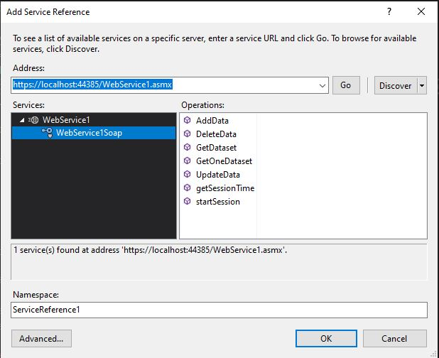

## soap-api-consume

Creating local SoapApi and SoapConsume using C# windows form and .Net app

C# windows formu ve .Net kullanarak yerel ağda SoapApi ve SoapConsume oluşturma

First of all, you need to run webform. Then before running winform you need to right click references and click add servide reference as you see below photo.

İlk olarak, web formunu çalıştırmanız gerekir. Ardından winform'u çalıştırmadan önce, referansları sağ tıklamanız ve aşağıdaki fotoğrafta gördüğünüz gibi hizmet referansı ekle'yi tıklamanız gerekir.

  

Then you need to write your local web service link to adress text area and click go. You will see the service and its operations. Then click ok.

Ardından metin alanına yerel web hizmeti bağlantınızı yazmanız ve git'e tıklamanız gerekir. Servisi ve işlemlerini göreceksiniz. Ardından tamam'ı tıklayın.

  

The last thing you should do is creating database which has column as a id, name, surname, age, location. When you write your database connection string to winform conn str texbox. You can do CRUD operation using Soap Web service.

Yapmanız gereken son şey id, isim, soy isim, yaş, konum alanları olan bir veritabanı oluşturmaktır. Winform conn str texbox'a veritabanı bağlantı dizenizi yazdığınızda, Soap Web servisini kullanarak CRUD işlemini yapabilirsiniz.

  

